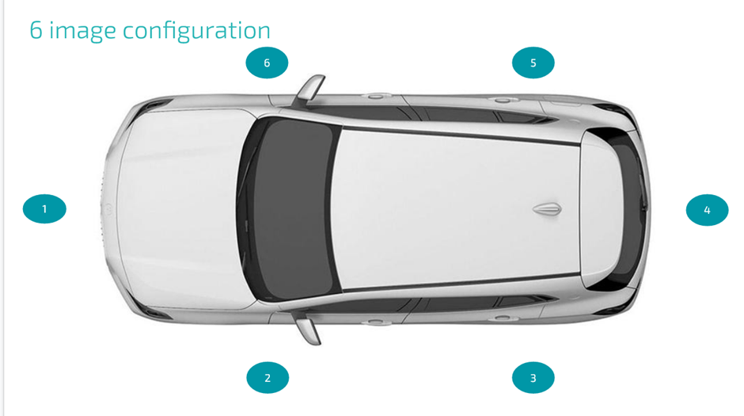
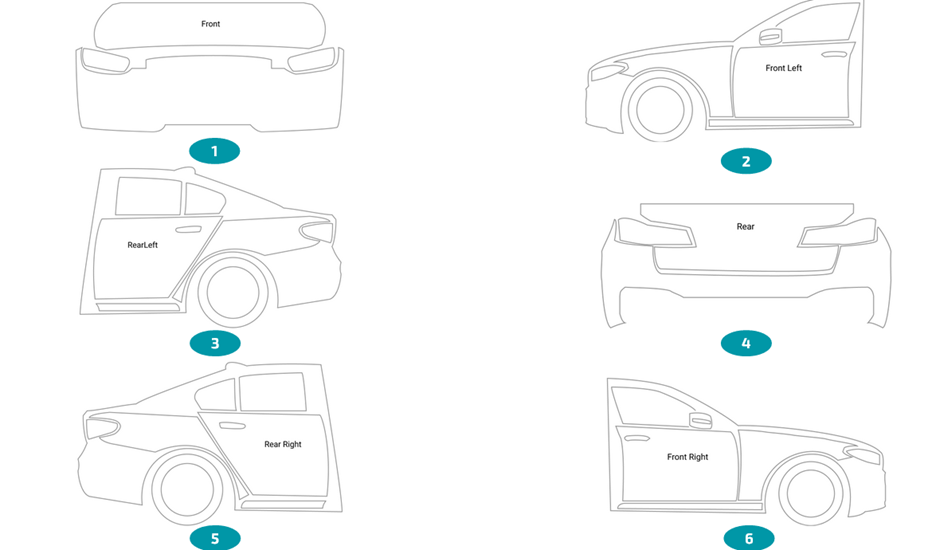

## Exercise 1: Real-Time Detection

### Summary Problem Statement

The objective of this assignment is to build a **real-time, edge-deployable computer vision solution** that validates whether a user has captured the correct image of a car according to a predefined overlay configuration.

The overlays guide users to capture images of a vehicle from specific viewpoints. The system must verify, in real time on a **mobile device**, whether the captured frame or image matches the required overlay.





---

## Problem Description

The overlay configuration consists of **six distinct viewpoints** of a vehicle. Each viewpoint corresponds to a specific image type:

- Front
- FrontLeft
- RearLeft
- Rear
- RearRight
- FrontRight

A user attempts to capture images of a car from all sides to cover all major parts of the vehicle. Each captured image must be classified into one of the above six categories.

### Key Requirements

- The input is a **single image or frame**.
- The system must identify **which of the six categories** the image belongs to.
- The test image **may not belong to any of the six categories**. Images can be random or irrelevant.
- The solution must run **on the edge (mobile device)** and operate in real time.

---

## Model Objective

Train a model that:

- Takes an image as input
- Predicts one of the six predefined vehicle viewpoints
- Handles images that do not belong to any category (implicitly or explicitly)

---

## Post-Training Requirements

Once the model or logic is ready:

1. Convert the trained model to **TensorFlow Lite (`.tflite`) format**.
2. Implement an **inference / prediction pipeline** that:
   - Reads images from a test folder
   - Runs inference using the TFLite model
   - Stores predictions in a **Pandas DataFrame**

The inference script **must be named**:

```
test_predict.py
```

---

## Evaluation Criteria

- The model will be evaluated on ClearQuote’s **internal testing dataset**.
- The **performance metric** is the **F1 score for each of the six image categories**.

---

## Dataset Information

### Dataset Link

https://drive.google.com/file/d/12dXSLNwbArubn25XjcMBd-Pqw7go4ShN/view?usp=sharing

### Dataset Format

- The dataset consists of **multiple folders containing images**.
- Images are grouped into folders **only for readability**.
- All images are visually similar in structure.
- Annotations are created using the **VIA (VGG Image Annotator) Tool**.
- Annotations are stored **folder-wise** in **JSON format**.
- Annotations cover **almost all parts of the car**.
- It is acceptable to **ignore certain annotation classes** if they are not required for solving the problem.

---

## Annotation Structure

Each annotation entry follows the structure below:

```
{
  'filename': 'scraped_Cou1uG_1654879781205.jpg',
  'size': 0,
  'regions': [
    {
      'shape_attributes': {
        'name': 'polygon',
        'all_points_x': [462, 586, 582, 457],
        'all_points_y': [135, 143, 216, 206]
      },
      'region_attributes': {
        'identity': 'LCD',
        'reading': ''
      }
    },
    {
      'shape_attributes': {
        'name': 'polygon',
        'all_points_x': [475, 533, 531, 473],
        'all_points_y': [183, 188, 207, 202]
      },
      'region_attributes': {
        'identity': 'panel_x'
      }
    }
  ],
  'file_attributes': {}
}
```

### Important Notes on Annotations

- **filename**: Use this value as the actual image filename. Do not use the VGG key, as it is a combination of filename and size.
- **regions**: A list of annotated objects within the image.
- **shape_attributes**:
  - Contain the polygon coordinates of each object
  - Coordinates are **absolute pixel values**
- **region_attributes**:
  - Contain the class name or OCR reading (if applicable)

---

## Deliverables

The final submission must include:

1. The **complete inference pipeline**
2. The **TFLite model(s)** required to run predictions on the testing dataset
3. A documentation file describing:
   - Dataset preparation
   - Data augmentation (if any)
   - Model architecture
   - Training parameters and hyperparameters

This documentation file must be named:

```
readme.txt
```

---

## Packaging Instructions

- Archive all files into **one single archive**
- Supported formats: `.zip` or `.tar.gz`
- Naming convention:

```
product_overlay_firstname_last_name

Example:
product_overlay_john_doe.tar.gz
```

---

## Execution Requirement

Since the evaluation will be performed by ClearQuote:

- The submission must be **fully runnable on a new system**
- Provide **clear setup and execution instructions**
- The evaluation outcome depends entirely on the ability to successfully run `test_predict.py`
